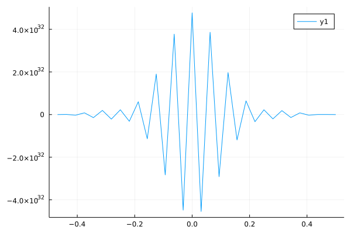

# Schrodinger3DFDM
Julia code that solves the 3-dimensional Schrodinger Equation using Finite Difference Method.

## Progress

Values are available till the 20th step, after which they explode. The norm is not conserved. I am still troubleshooting the code.
