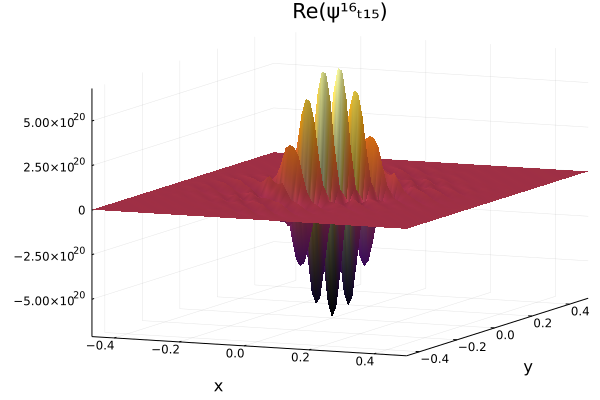
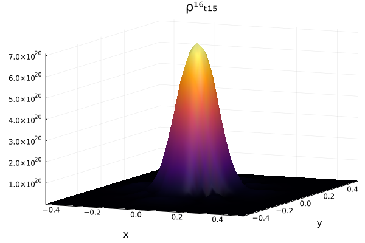
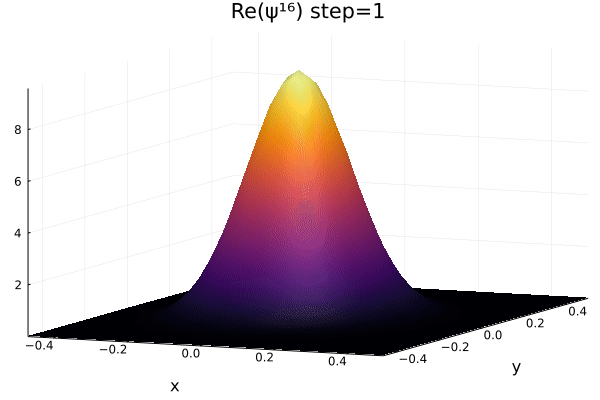
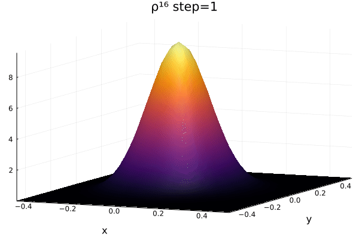

# Schrodinger3DFDM
Julia code that solves the 3-dimensional Schrodinger Equation using Finite Difference Method.

## Running the code
Make sure you have Julia v`1.6` installed. Go to the REPL, and execute the following lines.

```julia
include("src/solve.jl")
solveAll(ψ)
```

This should solve the code for all time instances, as set up in the `1D.jl` file. 
## Progress





Values are available till the 20th step, after which they explode. The norm is not conserved. I am still troubleshooting the code.
